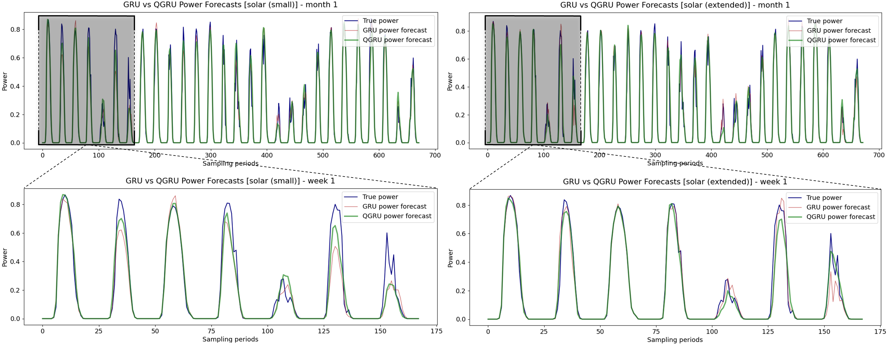
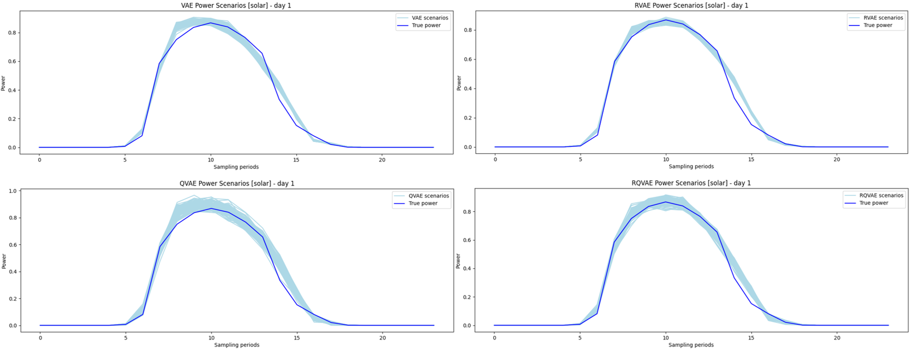

# Quaternion Models for Renewable Energy: weather-based power data generation and forecasting

This repository includes the official implementation of the code refeered to the IEEE paper https://ieeexplore.ieee.org/document/10382909

> Gianfranco Di Marco, Danilo Comminiello, Michele Scarpiniti, Aurelio Uncini: "*Quaternion Gated Recurrent Units for Renewable Energy: Improving Power Forecasting*", IEEE:10.1109/ICECS58634.2023.10382909, 2023

The complete project also contains power data generation and forecasting with Generative Models, i.e. Variational Autoencoders and Generative Adversarial Networks.

## Table of contents

- [Overview](#overview)
- [Setup](#setup)
- [Usage](#usage)
- [Paper results](#paper-results)
- [Contacts](#contacts)
- [Citations](#citations)
- [License](#license)


## Overview

<h3 align="center">Power Forecasting</h3>




<h3 align="center">Power Scenarios Generation</h3>




One of the current main challenges in the production of energy is the difficulty to store it, requiring to balance perfectly the produced power with the users need. Renewable Energy is even more challenging, because it has a strong dependency on weather conditions.

- The **Power Forecasting** task allows to predict how much energy is going to be produced by a specific plant, given the weather conditions at the site.
- The **Power Scenarios Generation** task is useful to simulate different scenarios of energy production, enabling synthetic dataset creation, plant optimization, management, etc.

In this project is possible to execute both the tasks (**day-ahead** forecasting), by exploiting the . Check the sections below to understand how to setup and use it.

### Project Structure

Here is an overview of the repository structure:

- [src](src): The source code of the project, encapsulated in the `qnets_power` package.
- [notebooks](notebooks): Jupyter notebooks to run the code from *src* in a even easier way.
- [scripts](scripts): Initialization/Utility scripts. For instance, there is the [dataset preparation](scripts/dataset_preparation.py) script to prepare data from the [GEFCom 2014 Dataset](https://www.sciencedirect.com/science/article/pii/S0169207016000133#s000140).
- [assets](assets): Other utilities, like doc images.
- Dynaconf files: [config](config.py), [settings](settings.toml) and *.secrets* (local, to be created from the user), to handle the general configuration of the project.
- [pyproject](pyproject.toml): The project setup file.
- Generated files: Other than the content above, after the first execution, the following folders (initally empty) will be populated automatically:
  - [data](data): Dataset folder with the GEFCom_2014 dataset.
  - [results](results): The results from the execution, e.g. forecasts and scenarios.
  - [checkpoints](checkpoints): Weights of the models used in the experiments.
  - [normalizer](normalizer): Data normalizers files, useful to avoid re-initialize and configure the normalizers at every run.
  - [lightning-logs](lightning_logs): Folder containing all the logs from the PyTorch Lightning execution.


## Setup


### Software

The `qnets_power` package setup is handled by the [pyproject](pyproject.toml) file in the root folder. Install the python requirements needed by it by simply running, from the root:
```
$ pip install -e .
```

### Data

Data setup is as simple as the previous one. You can use the [dataset preparation](scripts/dataset_preparation.py) python script to automatize the following steps:
1. Data folders preparation
2. GEFCom_2014 dataset download
3. Data archives extraction
4. Relevant data files repositioning
5. Unnecessary archives deletion

Run the script from the [scripts](scripts) folder like:
```
$ python dataset_preparation.py
```

> [!TIP]
> By default, the script will extract data into the [data](data) folder. You can also configure a different destination, either in the script, or in the settings file. 


## Usage

### Parameters configuration

Before to run an experiment, be sure to have all its parameters configured properly. The configuration system of this project is based on the [dynaconf](https://www.dynaconf.com/) standard; as said before, conf files are [config.py](backend/src/config.py), [settings.toml](backend/src/settings.toml) and [.secrets.toml](backend/src/.secrets.toml), allowing to configure everything about the app usage, user data, and so on in a modular and pythonic way. The *.secrets.toml* file is not visible here because it's included in the *.gitignore*, so that you can create it by yourself and keep there all the personal secret variables, without sharing them with anyone.

📋 Normally all these files are generated by running the command `dynaconf init`, but here is not necessary since they are already prepared.

### Project execution

In order to run an experiment, you just have to execute the [main](src/qnets_power/main.py) file as a module:
```
$ python -m qnets_power.main [-h] [--args]
```

Here are the arguments to be used for the script:
- `--model model [model_2] [model_3] ...`: model(s) for which to run the experiment, to be chosen among `vae`, `rvae`, `qvae`, `rqvae`, `gan`, `qgan`, `rnn`, `qrnn`.
- `--energy-source source`: target data source of the experiment, i.e. `solar` or `wind`.
- `--quaternion-mode mode`: quaternion organization for the dataset, that can be `reshape`, `organize`, or `timestack`. Check the paper linked in the first section to understand more about this. 
- `--train`: set if to train the specified model(s).
- `--test`: set if to test the specified model(s).
- `--speed-check`: make a forward speed check for the model(s).
- `--save-config`: save global parameters and net(s) structure.
- `--num-epochs`: desired number of train epochs.
- `--num-scenarios`: # scenarios to generate (always 1 for RNN).
- `--des-metric`: select the desired metric to choose scenarios, among `mape`, `rmse`, `mbe`, `pcorr`, `mae`, `cosi`, `crps`, `es`, and `qs`.

📋 As before, you can either use the default parameters defined in the dynaconf files, or override them by specifing the arguments as described.

> [!TIP]
> Instead of coming back to this readme, get hints about the main execution by using the `-h` or the `--help` flag after the script name.

### Execution examples

- Power forecasting example with:
  - Fresh Quaternion Gated Recurrent Unit model
  - Day-ahead forecast of solar energy
  - Data organized in humidity, pressure, wind and solar groups
  ```
  $ python -m qnets_power.main --model qrnn --energy-source solar --quaternion-mode organize --train --test
  ```

- Power scenarios generation example with:
  - Already trained Robust Quaternion Variational Autoencoder model
  - Generation of 100 scenarios of wind energy
  - Metrics computed for all scenarios, selecting the one with the best Mean Absolute Error
  ```
  $ python -m qnets_power.main --model rqvae --energy-source wind --test --des-metric mae
  ```

## Paper results

The quaternion neural networks show a great capability of extracting the mutual relationships hidden in the data, using much less model parameters. For this reason, they are normally used in the images field, since they are made of exactly 4 channels (RGB + alpha), directly convertible to a quaternion.

We demonstrated that they are adaptable also to the task of power data forecasting based on weather, by organizing data in a meaningful way so that the relationship extraction is simplified. For instance, we know from physics that many humidity, pressure, wind and solar variables are related between each other by some equations; organizing these variables in these groups as a quaternion, allows the Q-models to capture many more relationships than normal.

Here is a summary table with the results of the paper, showing that the Q-models, specially the RNN, outperform their normal counterparts when there are sufficient features in a well organized system:

<table id="qgru-metrics">
  <thead>
    <tr>
      <th rowspan=0 style="text-align: center;"></th>
      <th colspan=4 style="text-align: center;">Solar Dataset</th>
      <th colspan=4 style="text-align: center;">Wind Dataset</th>
    </tr>
    <tr>
      <th colspan=2 style="text-align: center;">Small dataset</th>
      <th colspan=2 style="text-align: center;">Extended dataset</th>
      <th colspan=2 style="text-align: center;">Small dataset</th>
      <th colspan=2 style="text-align: center;">Extended dataset</th>
    </tr>
    <tr>
      <th colspan=1 style="text-align: center;">GRU</th>
      <th colspan=1 style="text-align: center;">QGRU</th>
      <th colspan=1 style="text-align: center;">GRU</th>
      <th colspan=1 style="text-align: center;">QGRU</th>
      <th colspan=1 style="text-align: center;">GRU</th>
      <th colspan=1 style="text-align: center;">QGRU</th>
      <th colspan=1 style="text-align: center;">GRU</th>
      <th colspan=1 style="text-align: center;">QGRU</th>
    </tr>
  </thead>
  <tbody>
    <tr>
      <td>MAE</td>
      <td>0.0332</td>
      <td><b>0.0322</b></td>
      <td>0.0292</td>
      <td><b>0.0284</b></td>
      <td>0.1171</td>
      <td><b>0.1118</b></td>
      <td>0.1140</td>
      <td><b>0.1135</b></td>
    </tr>
    <tr>
      <td>MAPE</td>
      <td>27.210</td>
      <td><b>6.7344</b></td>
      <td>20.119</td>
      <td><b>12.404</b></td>
      <td>4932.2</td>
      <td><b>3801.0</b></td>
      <td>4901.7</td>
      <td><b>4538.4</b></td>
    </tr>
    <tr>
      <td>RMSE</td>
      <td><b>0.0714</b></td>
      <td>0.0723</td>
      <td>0.0662 </td>
      <td><b>0.0655</b></td>
      <td>0.1627</td>
      <td><b>0.1617</b></td>
      <td>0.1625</td>
      <td><b>0.1624</b></td>
    </tr>
    <tr>
      <td>MBE</td>
      <td>-0.0032</td>
      <td><b>0.0018</b></td>
      <td><b>-0.0004</b></td>
      <td>0.0006</td>
      <td><b>-0.0056</b></td>
      <td>-0.0089</td>
      <td>-0.0084</td>
      <td><b>0.0051</b></td>
    </tr>
    <tr>
      <td>PCORR</td>
      <td><b>0.9658</b></td>
      <td>0.9650</td>
      <td>0.9706</td>
      <td><b>0.9713</b></td>
      <td>0.8595</td>
      <td><b>0.8639</b></td>
      <td>0.8613</td>
      <td><b>0.8631</b></td>
    </tr>
    <tr>
      <td>COSI</td>
      <td><b>0.9765</b></td>
      <td>0.9760</td>
      <td>0.9798</td>
      <td><b>0.9803</b></td>
      <td>0.9439</td>
      <td><b>0.9447</b></td>
      <td>0.9441</td>
      <td><b>0.9449</b></td>
    </tr>
    <tr>
      <td>CRPS</td>
      <td><b>3.3151</b></td>
      <td>3.2159</td>
      <td>2.9191</td>
      <td><b>2.8436</b></td>
      <td>11.714</td>
      <td><b>11.178</b></td>
      <td>11.398</td>
      <td><b>11.347</b></td>
    </tr>
  </tbody>
</table>


## Contacts

For info and reference about this repository, trace an issue or contact:
- **Di Marco, Gianfranco** - gianfrancodimarco98@outlook.it


## Citations

If you use parts of this code, please cite the official paper as:

```
@INPROCEEDINGS{10382909,
  author={Di Marco, Gianfranco and Comminiello, Danilo and Scarpiniti, Michele and Uncini, Aurelio},
  booktitle={2023 30th IEEE International Conference on Electronics, Circuits and Systems (ICECS)}, 
  title={Quaternion Gated Recurrent Units for Renewable Energy: Improving Power Forecasting}, 
  year={2023},
  volume={},
  number={},
  pages={1-4},
  keywords={Photovoltaic systems;Renewable energy sources;Quaternions;Biological system modeling;Neural networks;Wind power generation;Predictive models;Quaternion Neural Networks;Energy Forecasting;Time Series;Recurrent Neural Networks},
  doi={10.1109/ICECS58634.2023.10382909}}
```


## License

This project is licensed for **academic and non-commercial use only**.
Commercial use requires written permission from the author.